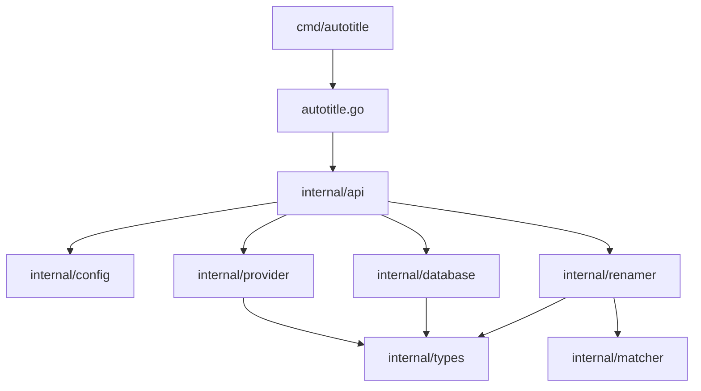

# Autotitle Internal Documentation

> **Note:** This documentation covers the internal implementation details of autotitle v2. The public API is stable, but internal packages may change.

## Architecture Overview

Autotitle v2 follows a clean, domain-driven architecture:



## Package Details

### `internal/types`

The core domain package. Contains all shared types, errors, and interfaces.

- **`types.go`**: Domain models (`Media`, `Episode`, `RenameOperation`).
- **`interfaces.go`**: Core interfaces (`Provider`, `DatabaseRepository`, `FillerSource`).
- **`errors.go`**: Custom typed errors.

### `internal/api`

The business logic orchestration layer. This package implements the high-level operations exposed by the libraries and CLI.

- **Context-aware**: All functions accept `context.Context`.
- **Stateless**: Functions are largely stateless, initializing dependencies as needed.
- **Key Functions**:
  - `Rename(ctx, path, opts)`
  - `Init(ctx, path, url, fillerURL)`
  - `DBGen(ctx, url, fillerURL)`
  - `CleanAll(ctx)` (Global cleanup)

### `internal/provider`

Handles fetching metadata from external sources.

- **Registry**: Central registry for providers and filler sources.
- **MALProvider**: Implements `Provider` interface for MyAnimeList (via Jikan API).
- **Filler Source**: Decoupled filler detection (e.g., AnimeFillerList).
- **Extensibility**: specific providers implement the `Provider` interface and register themselves in `init()`.

### `internal/database`

Handles persistence of media information.

- **Repository Pattern**: Implements `types.DatabaseRepository`.
- **Storage**: JSON files organized by provider subdirectories (`~/.cache/autotitle/db/{provider}/{id}@{slug}.json`).
- **Unified Model**: Stores `types.Media` which includes merged episode and filler data.

### `internal/config`

Configuration loading and validation.

- **Structure**:
  ```go
  type Config struct {
      Targets []Target
  }
  type Target struct {
      Path      string
      URL       string
      FillerURL string
      Patterns  []Pattern
  }
  ```
- **Validation**: Enforces required fields and valid patterns at load time.

### `internal/renamer`

Orchestrates the actual file renaming process.

- **Event-Driven**: Uses `types.EventHandler` to report progress (Info, Success, Warning, Error).
- **Dry-Run**: Supports preview mode without modifications.
- **Logic**:
  1. Scans directory for video files.
  2. Matches filenames against configured patterns.
  3. Lookups episode data in the database.
  4. Generates new filenames.
  5. Executes rename (or simulates).

### `internal/matcher`

Pattern matching and filename generation.

- **`MatchResult`**: Structured result containing EpisodeNum, Resolution, Extension.
- **`MatchTyped`**: Strongly-typed matching function.
- **Fallbacks**: Supports multiple input patterns.

## Development

### Adding a New Provider

1. Create `internal/provider/{name}.go`
2. Implement `types.Provider` interface:
   - `Name() string`
   - `Type() MediaType`
   - `MatchesURL(url) bool`
   - `ExtractID(url) (string, error)`
   - `FetchMedia(ctx, id) (*Media, error)`
3. Register in `init()`: `RegisterProvider(NewProvider())`

### Running Tests

```bash
go test ./...
```
